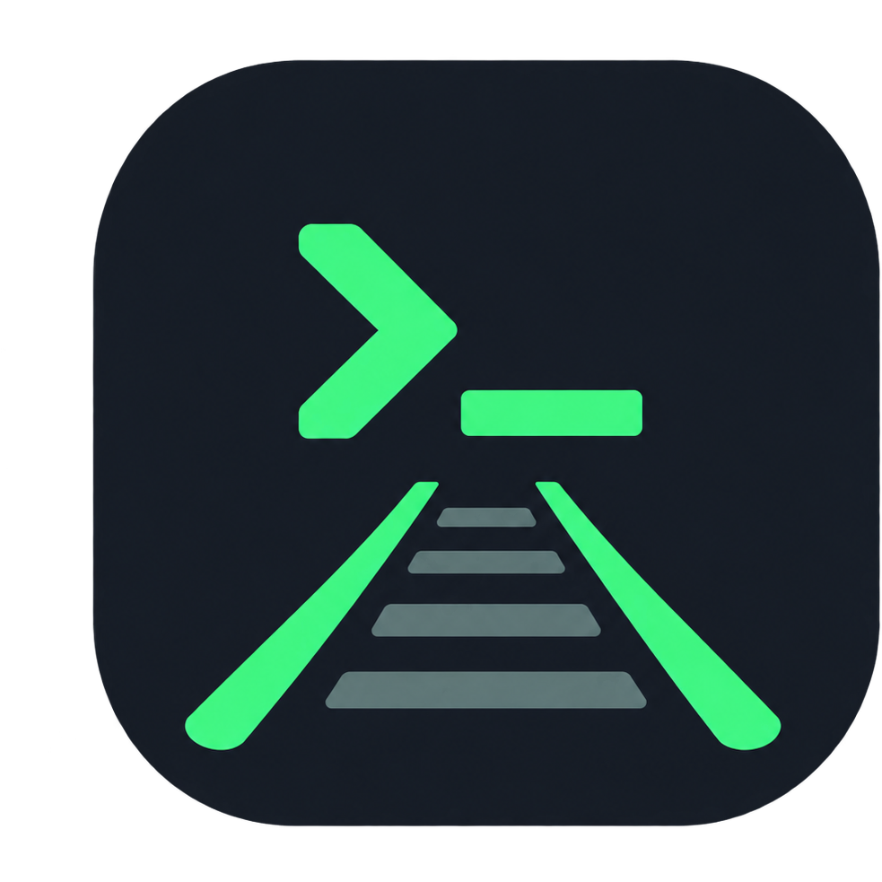
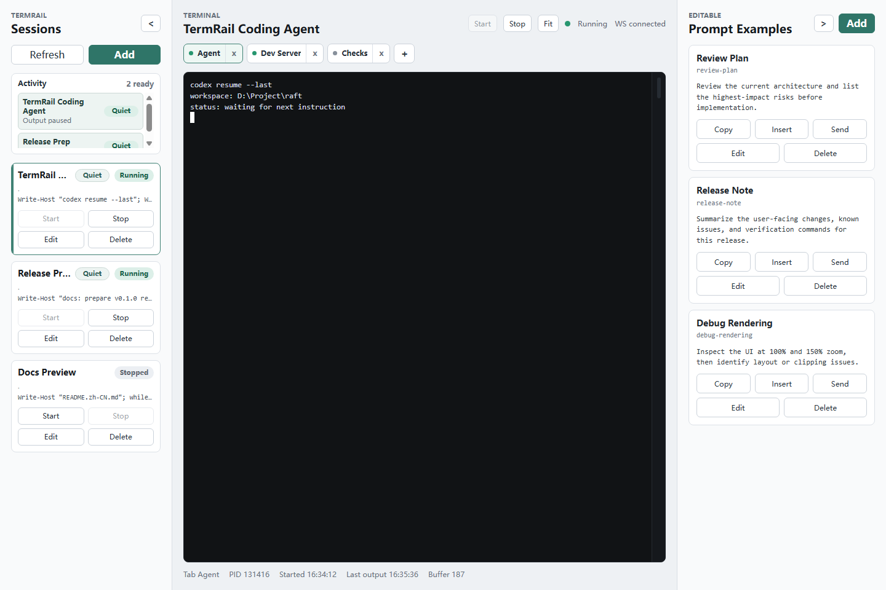

# TermRail

[简体中文](README.zh-CN.md)

<p align="center">
  
</p>

Local browser dashboard for persistent terminal sessions.

When working with coding agents across multiple projects, developers often need to keep several long-running shell commands alive at the same time: project shells, development servers, Codex, Claude Code, test commands, and supporting scripts. TermRail organizes those commands into saved, switchable sessions and lets you manage startup, interaction, and output from a local browser UI.

TermRail is built for trusted local developer workstations.



## Features

- Start, stop, and switch between named terminal sessions.
- Open multiple terminal tabs inside one session.
- Run real interactive shells through xterm.js and node-pty.
- Keep live output streaming over WebSocket.
- See background activity with `Working`, `Quiet`, and `Stopped` indicators.
- Manage reusable prompts with copy, insert, and send actions.
- Pick local working directories from the UI.
- Collapse side panels to give the terminal more room.
- Keep large terminal scrollback in the browser and server-side buffers during runtime.
- Protect local HTTP and WebSocket access with an optional auth token.

## Requirements

- Windows, macOS, or Linux.
- Node.js `18.x`, `20.x`, or `22+`.
- npm.
- On Windows, Visual Studio C++ build tools may be required if `node-pty` cannot use a prebuilt package.

## Quick Start

### Windows

```powershell
powershell -ExecutionPolicy Bypass -File .\start.ps1
```

The script checks for Node.js and npm, installs dependencies when `node_modules/` is missing, starts the backend and Vite UI, and opens the app in your browser.

### Manual Start

```powershell
npm install
npm start
```

Development services:

| Service                   | URL                     |
| ------------------------- | ----------------------- |
| UI                        | `http://127.0.0.1:5173` |
| Backend API and WebSocket | `http://127.0.0.1:8787` |

Vite proxies `/api` and `/ws` to the backend during development.

## Sessions

Open the UI and choose **Add** to create a session. A new session starts with
no terminal tabs; use **New terminal** to add a command.

| Field       | Description                                                    |
| ----------- | -------------------------------------------------------------- |
| `id`        | Stable session id used by the API and WebSocket.               |
| `name`      | Display name shown in the UI.                                  |
| `cwd`       | Working directory for terminal commands.                       |
| `terminals` | Per-session terminal tabs, each with an id, name, and command. |
| `prompts`   | Legacy per-session prompts; the UI uses global prompts now.    |

Example session:

```json
{
  "id": "my-project-codex",
  "name": "My Project Codex",
  "cwd": "D:\\Project\\my-project",
  "terminals": [
    {
      "id": "codex",
      "name": "Codex",
      "command": "codex resume"
    },
    {
      "id": "server",
      "name": "Dev Server",
      "command": "npm run dev"
    }
  ],
  "prompts": []
}
```

Session `cwd` values may be absolute or relative to this repository root.

## Configuration

Runtime config lives at `data/config.json`. Git ignores this file because it can contain private local paths and commands.

Older configs with a session-level `command` are migrated when loaded. Existing
terminal commands take precedence; if an old session has no terminal list, its
command becomes a `Main` terminal. The normalized format is written on the next
configuration change.

An empty config is created automatically:

```json
{
  "prompts": [],
  "sessions": []
}
```

`data/config.example.json` is safe to commit and is used by the smoke test. You can copy it to start from known-good sample sessions:

```powershell
Copy-Item data/config.example.json data/config.json
```

## Environment

| Variable               | Default                     | Description                                   |
| ---------------------- | --------------------------- | --------------------------------------------- |
| `HOST`                 | `127.0.0.1`                 | Backend bind host.                            |
| `PORT`                 | `8787`                      | Backend port.                                 |
| `AUTH_TOKEN`           | empty                       | Token accepted by the HTTP API and WebSocket. |
| `CONFIG_PATH`          | `data/config.json`          | Runtime config path override.                 |
| `TERMRAIL_SHELL`       | `powershell.exe` on Windows | PTY shell override used by the server.        |
| `TERMRAIL_WINDOWS_PTY` | `conpty` on Windows         | Windows PTY backend: `conpty` or `winpty`.    |
| `VITE_AUTH_TOKEN`      | empty                       | Frontend token for manual Vite startup.       |

When using `start.ps1`, setting `AUTH_TOKEN` is enough; the script mirrors it into `VITE_AUTH_TOKEN` before starting the UI.

TermRail uses ConPTY on Windows and sends keyboard input through the Windows console API so Unicode input remains compatible with terminal applications such as Codex CLI. WinPTY remains available as a fallback through `TERMRAIL_WINDOWS_PTY=winpty`.

## Security Model

TermRail starts local commands from saved session configuration. Treat access to the app as access to your local shell.

- The backend binds to `127.0.0.1` by default.
- Runtime config is stored locally in `data/config.json`.
- `data/config.json`, `.env`, and logs are ignored by Git.
- Directory browsing endpoints are intended for trusted local use.
- Set `AUTH_TOKEN` before binding outside localhost.
- Use a private network layer such as Tailscale or another VPN for remote access.

## API

When `AUTH_TOKEN` is set, authenticate with one of these options:

- `Authorization: Bearer <token>`
- `x-auth-token: <token>`
- `?token=<token>`

Common HTTP endpoints:

| Method   | Path                                            |
| -------- | ----------------------------------------------- |
| `GET`    | `/api/sessions`                                 |
| `POST`   | `/api/sessions`                                 |
| `PATCH`  | `/api/sessions/:id`                             |
| `DELETE` | `/api/sessions/:id`                             |
| `GET`    | `/api/sessions/:id/terminals`                   |
| `POST`   | `/api/sessions/:id/terminals`                   |
| `PATCH`  | `/api/sessions/:id/terminals/:terminalId`       |
| `POST`   | `/api/sessions/:id/terminals/:terminalId/start` |
| `POST`   | `/api/sessions/:id/terminals/:terminalId/stop`  |
| `DELETE` | `/api/sessions/:id/terminals/:terminalId`       |
| `GET`    | `/api/status`                                   |
| `GET`    | `/api/filesystem/roots`                         |
| `GET`    | `/api/filesystem/directories?path=<folder>`     |

WebSocket clients connect to `/ws`.

Client messages:

```json
{
  "type": "subscribe",
  "sessionId": "my-project-codex",
  "terminalId": "codex",
  "includeBuffer": true
}
```

```json
{
  "type": "input",
  "sessionId": "my-project-codex",
  "terminalId": "codex",
  "data": "hello\r"
}
```

```json
{
  "type": "resize",
  "sessionId": "my-project-codex",
  "terminalId": "codex",
  "cols": 120,
  "rows": 32
}
```

Server messages include `subscribed`, `unsubscribed`, `terminal.output`, `terminal.status`, `session.status`, and `error`.

## Development

```powershell
npm run dev
```

Useful checks:

```powershell
npm test
npm run check
npm run format:check
npm run smoke --workspace server
```

The smoke test starts a temporary backend on `127.0.0.1:8797`, loads `data/config.example.json`, subscribes over WebSocket, and verifies PTY output and Unicode input.

Project layout:

```text
server/   Express API, WebSocket server, PTY session manager
shared/   Shared TypeScript types and constants
web/      Vite, React, xterm.js terminal UI
data/     Example config and local runtime config location
```

## Known Issues

- First-run setup is still manual. If there are no sessions, use **Add** in the UI or copy `data/config.example.json` to `data/config.json`.
- Runtime terminal buffers are retained while the backend process is running; persistent transcript search/export is not implemented yet.

## Troubleshooting

- UI opens and sessions fail to load: confirm the backend is running on `127.0.0.1:8787`.
- `node-pty` install errors on Windows: install Visual Studio C++ build tools or use a supported Node.js version.
- Auth-enabled manual startup: set both `AUTH_TOKEN` and `VITE_AUTH_TOKEN` before running `npm start`.
- Windows ConPTY startup issues: set `TERMRAIL_WINDOWS_PTY=winpty` and restart the backend.
- TUI size mismatch after startup: use the **Fit** button in the terminal header.

## Roadmap

- Evaluate desktop packaging or installer distribution so TermRail does not require manual local dev-server startup.
- Refine session creation, terminal history, and export workflows based on real usage.
